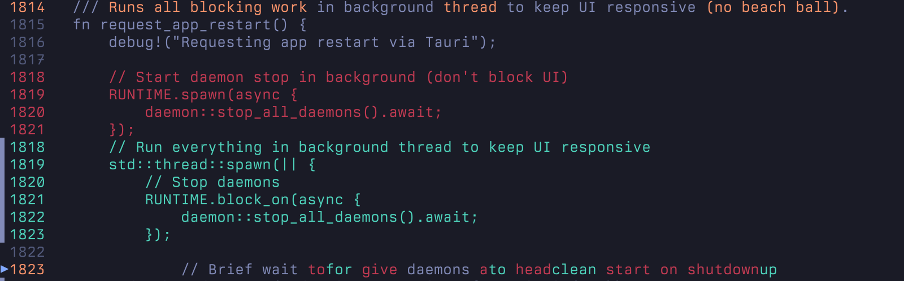

<div align="center">

# oyo

A diff viewer that works **two ways**:
**step through changes** or **review a classic scrollable diff**.


<!-- Demo source: https://github.com/user-attachments/assets/0f43b54b-69fe-4cf3-9221-a7749872342b -->
https://github.com/user-attachments/assets/0f43b54b-69fe-4cf3-9221-a7749872342b

</div>

**oyo** extends traditional diffs with an optional step-through mode. Use it like a normal diff viewer with scrolling and hunk navigation, or step through changes one at a time and watch the code evolve. You can switch between both modes at any time.

## Two ways to use oyo

### 1. Classic diff (scroll-only)
Review all changes at once, scroll freely, and jump between hunks, just like a traditional diff viewer.

- Scroll the full diff
- Jump between hunks
- No stepping required

Enable with:
- `oyo --no-step`
- Toggle in-TUI with `s`
- Set `stepping = false` in config

### 2. Step-through review (default)
Apply changes incrementally and watch the file transform from old → new.

- Step change-by-change
- See precise evolution of the code
- Useful for large refactors or careful reviews

oyo does **not** replace classic diffs, it adds a new way to review them.


## Features

- **Classic diff mode (no-step)**
  Scroll the full diff with hunk navigation, no stepping required
- **Step-through navigation**
  Move through changes one at a time with keyboard shortcuts
- **Hunk navigation**
  Jump between groups of related changes in both modes
- **Three view modes**:
  - **Single**: Watch the code morph from old to new state
  - **Split**: See old and new versions with synchronized stepping
  - **Evolution**: Watch the file evolve, deletions simply disappear
- **Word-level diffing**: See exactly which words changed within a line
- **Multi-file support**: Navigate between changed files with preserved positions
- **Search**: Regex search with to jump between matches
- **Syntax highlighting**: Toggle on/off for code-aware coloring (auto-enabled in no-step mode)
- **Line wrap**: Toggle wrapping for long lines
- **Animated transitions**: Smooth fade in/out animations as changes are applied
- **Playback**: Automatically step through all changes at a configurable speed
- **Git integration**: Works as a git external diff tool or standalone
- **Commit picker**: Browse recent commits and pick ranges interactively (`oy view`)
- **Themes**: Built-in themes plus `.tmTheme` syntax themes (configurable)
- **Configurable**: XDG config file support for customization

## Installation

### CLI (Cargo)

```bash
cargo install oyo
```

## Usage

### Classic diff (scroll-only)

```bash
oy --no-step
# or toggle in-app with `s`
```

### Step-through diff

```bash
oy
```

### Compare files

```bash
oy old.rs new.rs
```

### Commit picker

```bash
oy view
```

### View modes

```bash
oy old.rs new.rs --view split
oy old.rs new.rs --view evolution
```

### Autoplay

```bash
oy old.rs new.rs --autoplay
oy old.rs new.rs --speed 100
```

### Git ranges

```bash
oy --range HEAD~1..HEAD
oy --range main...feature
```

### Staged changes

```bash
oy --staged
```

---

## Git Integration

### Recommended (`git difftool`)

```bash
git difftool -y --tool=oy
```

`~/.gitconfig`:

```gitconfig
[difftool "oy"]
    cmd = oy "$LOCAL" "$REMOTE"

[difftool]
    prompt = false

[alias]
    d = difftool -y --tool=oy
```

> Note: keep your pager (`less`, `moar`, `moor`) for `git diff`.
> Do **not** set `core.pager` or `interactive.diffFilter` to `oy`.

---

## Jujutsu (jj)

```toml
[ui]
paginate = "never"
diff-formatter = ["oy", "$left", "$right"]

[diff-tools.oy]
command = ["oy", "$left", "$right"]
```

### Keyboard Shortcuts

**Vim-style counts**: Most navigation commands support count prefixes (e.g., `10j` moves 10 steps forward, `5J` scrolls down 5 lines).

| Key | Action |
|-----|--------|
| `↓` / `j` | Next step (scrolls in no-step mode; moves file selection when focused) |
| `↑` / `k` | Previous step (scrolls in no-step mode; moves file selection when focused) |
| `→` / `l` | Next hunk (scrolls in no-step mode) |
| `←` / `h` | Previous hunk (scrolls in no-step mode) |
| `b` | Jump to beginning of current hunk (scrolls in no-step mode) |
| `e` | Jump to end of current hunk (scrolls in no-step mode) |
| `p` / `P` | Peek change (modified → old → mixed) / Peek old hunk |
| `y` / `Y` | Yank line/hunk to clipboard |
| `/` | Search (diff pane, regex) |
| `n` / `N` | Next/previous match |
| `:line` / `:h<num>` / `:s<num>` | Go to line / hunk / step |
| `<` | First applied step |
| `>` | Last step |
| `gg` | Go to start (scroll-only in no-step mode) |
| `G` | Go to end (scroll-only in no-step mode) |
| `Space` / `B` | Autoplay forward/reverse |
| `Tab` | Toggle view mode |
| `K` | Scroll up (supports count) |
| `J` | Scroll down (supports count) |
| `H` | Scroll left (supports count) |
| `L` | Scroll right (supports count) |
| `0` | Start of line (horizontal) |
| `$` | End of line (horizontal) |
| `Ctrl+u` | Half page up |
| `Ctrl+d` | Half page down |
| `Ctrl+g` | Show full file path |
| `z` | Center on active change |
| `Z` | Toggle zen mode |
| `a` | Toggle animations |
| `w` | Toggle line wrap |
| `t` | Toggle syntax highlight |
| `E` | Toggle evo syntax (context/full) |
| `s` | Toggle stepping (no-step mode) |
| `S` | Toggle strikethrough |
| `r` | Refresh file (or all files when file list focused) |
| `f` | Toggle file panel |
| `Enter` | Focus file list |
| `]` | Next file (supports count) |
| `[` | Previous file (supports count) |
| `+` / `=` | Increase speed |
| `-` | Decrease speed |
| `?` | Toggle help |
| `q` / `Esc` | Quit (or close help) |

Clipboard support uses system tools: `pbcopy` (macOS), `wl-copy` / `xclip` / `xsel` (Linux), `clip` (Windows).
Search is case-insensitive regex; invalid patterns fall back to literal matching.

## Configuration

Create a config file at `~/.config/oyo/config.toml`:

```toml
[ui]
auto_center = true          # Auto-center on active change (default: true)
topbar = true               # Show top bar in diff view (default: true)
view_mode = "single"        # Default: "single", "split", or "evolution"
line_wrap = false           # Wrap long lines (default: false, uses horizontal scroll)
scrollbar = false           # Show scrollbar (default: false)
strikethrough_deletions = false # Show strikethrough on deleted text
gutter_signs = true         # Show +/- sign column (single/evolution)
stepping = true             # Enable stepping (false = no-step mode)
# [ui.diff]
# bg = false                # Full-line diff background (true/false)
# fg = "theme"              # "theme" or "syntax"
# highlight = "text"        # "text" | "word" | "none"
# extent_marker = "neutral" # "neutral" or "diff"
# extent_marker_scope = "progress" # "progress" or "hunk"
# [ui.split]
# align_lines = false       # Insert blanks to keep split panes aligned
# align_fill = "╱"          # Fill character for aligned blanks (empty = no marker)
# [ui.evo]
# syntax = "context"         # "context" (non-diff only) or "full" (diff + context)
# Syntax highlighting:
# - legacy: syntax = "on"    # "on" or "off"
# - table:
#   [ui.syntax]
#   mode = "on"              # "on" or "off"
#   theme = "tokyonight"     # builtin name or "custom.tmTheme" (from ~/.config/oyo/themes)
#                             # default: ui.theme.name, fallback to "ansi"
syntax = "on"
# [ui.single]
# modified_step_mode = "mixed" # "mixed" or "modified" (single-pane only)
# theme = { name = "tokyonight" } # Built-ins listed below
primary_marker = "▶"        # Marker for primary active line (single-width char recommended)
primary_marker_right = "◀"  # Right pane marker (optional, defaults to ◀)
extent_marker = "▌"         # Left pane extent marker (Left Half Block)
extent_marker_right = "▐"   # Right pane extent marker (optional, defaults to ▐)
zen = false                 # Start in zen mode (minimal UI)

[playback]
speed = 200                 # Autoplay interval in milliseconds
autoplay = false            # Start with autoplay enabled
animation = false           # Enable fade animations
animation_duration = 150    # Animation duration per phase (ms)
auto_step_on_enter = true   # Auto-step to first change when entering a file
auto_step_blank_files = true # Auto-step when file would be blank at step 0 (new files)

[files]
panel_visible = true        # Show file panel in multi-file mode
counts = "active"           # Per-file +/- counts: active, focused, all, off
```

Config is loaded from (in priority order):
1. `$XDG_CONFIG_HOME/oyo/config.toml`
2. `~/.config/oyo/config.toml`
3. Platform-specific (e.g., `~/Library/Application Support/oyo/config.toml` on macOS)

Theme and syntax theme configuration is documented in [THEME.md](./docs/THEME.md).

[](./docs/DIFF_PREVIEWS.md)

*Diff styling previews are available in [DIFF_PREVIEWS.md](./docs/DIFF_PREVIEWS.md).*

## How It Works

Stepping applies changes in file order. The view renders applied changes, highlights the
active change, and keeps pending changes muted.

## Development

```bash
# Build everything
cargo build

# Run tests
cargo test

# Run CLI in development
cargo run --bin oy -- old.rs new.rs
```
