# Diff Configuration Previews

## Foreground: Theme

### bg = false

#### highlight = "none"

```toml
[ui.diff]
fg = "theme"
bg = false
highlight = "none"
```

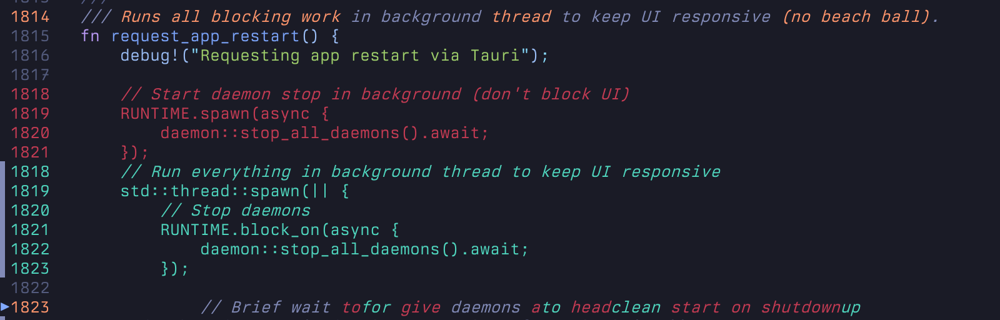

#### highlight = "word"

```toml
[ui.diff]
fg = "theme"
bg = false
highlight = "word"
```

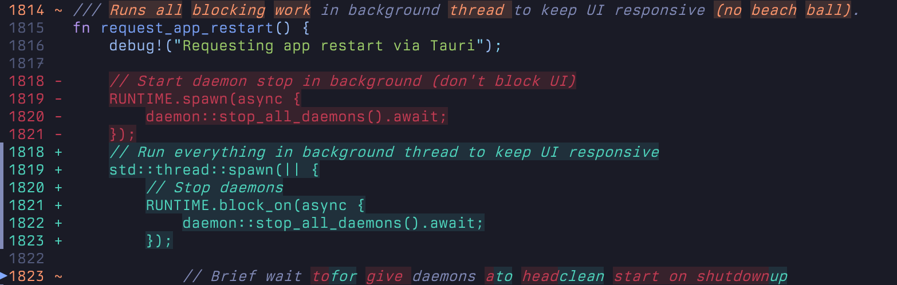

#### highlight = "text"

```toml
[ui.diff]
fg = "theme"
bg = false
highlight = "text"
```

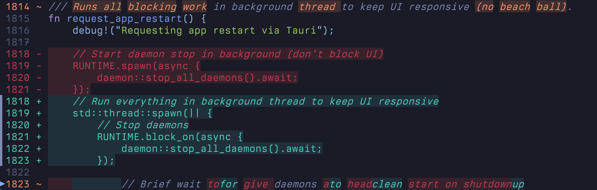

### bg = true

#### highlight = "none"

```toml
[ui.diff]
fg = "theme"
bg = true
highlight = "none"
```

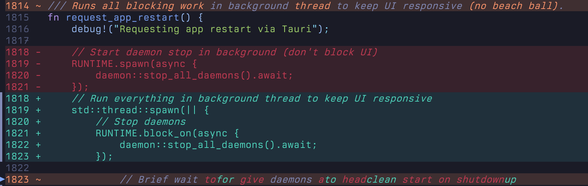

#### highlight = "text"

```toml
[ui.diff]
fg = "theme"
bg = true
highlight = "text"
```

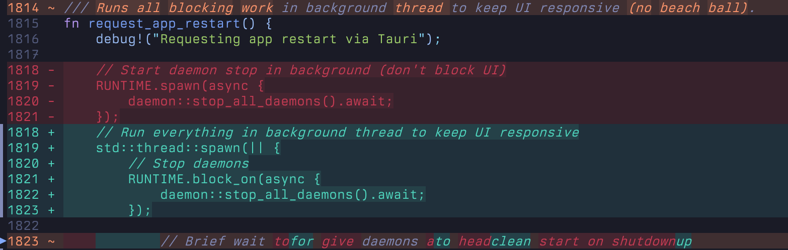

#### highlight = "word"

```toml
[ui.diff]
fg = "theme"
bg = true
highlight = "word"
```

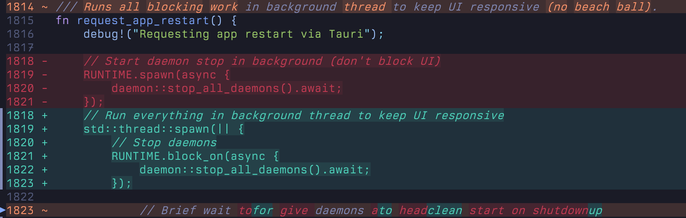

## Foreground: Syntax

### bg = false

#### highlight = "none"

```toml
[ui.diff]
fg = "syntax"
bg = false
highlight = "none"
```

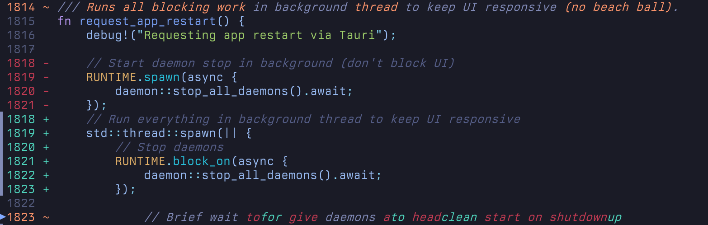

#### highlight = "text"

```toml
[ui.diff]
fg = "syntax"
bg = false
highlight = "text"
```

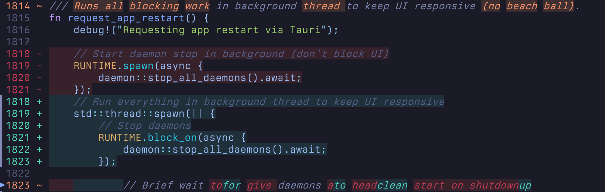

#### highlight = "word"

```toml
[ui.diff]
fg = "syntax"
bg = false
highlight = "word"
```


### bg = true

#### highlight = "none"

```toml
[ui.diff]
fg = "syntax"
bg = true
highlight = "none"
```

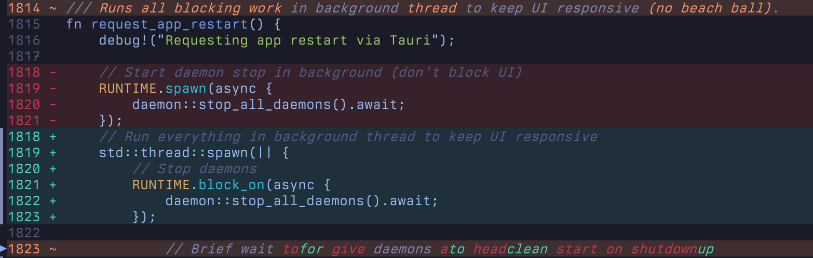

#### highlight = "text"

```toml
[ui.diff]
fg = "syntax"
bg = true
highlight = "text"
```


#### highlight = "word"

```toml
[ui.diff]
fg = "syntax"
bg = true
highlight = "word"
```

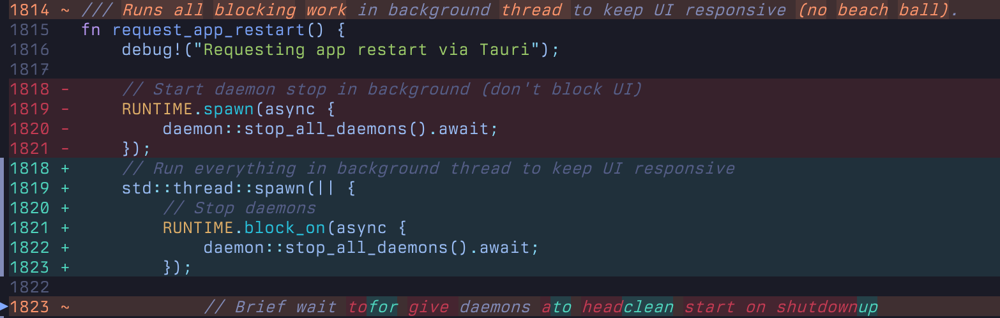

## Other Options

### Extent Markers

#### extent_marker_scope = "hunk"

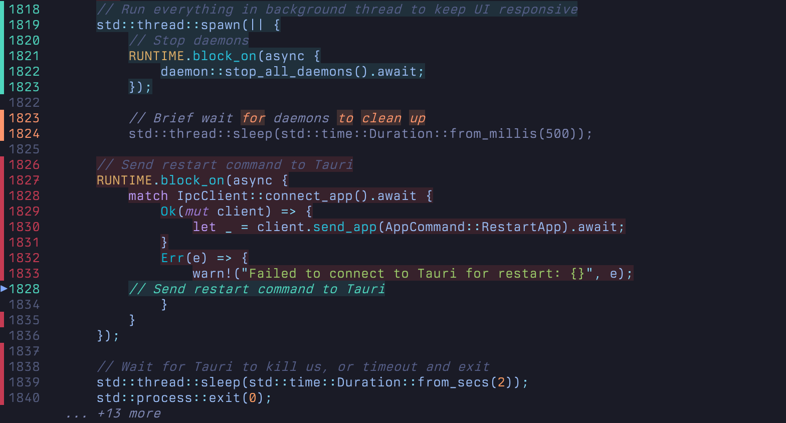

#### extent_marker_scope = "progress"

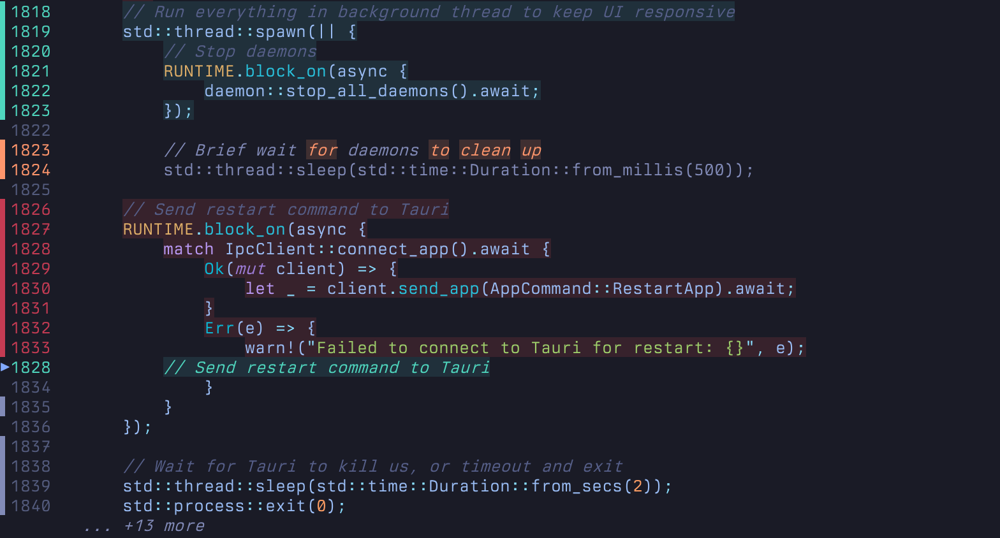

#### extent_marker = "diff"


### Gutter Signs

#### bg = false, gutter_signs = false

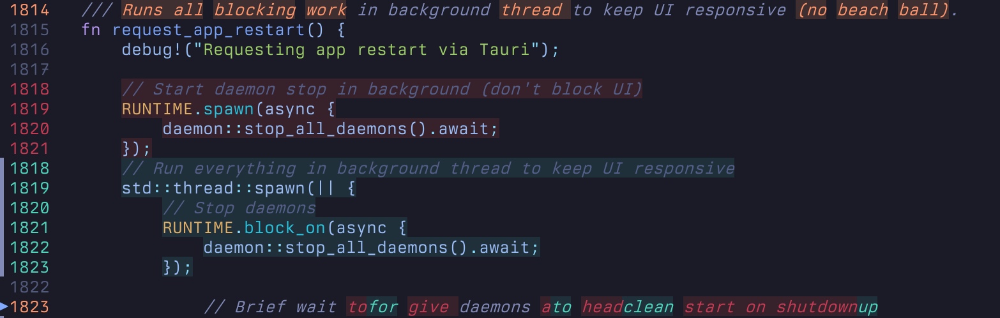

#### bg = true, gutter_signs = false

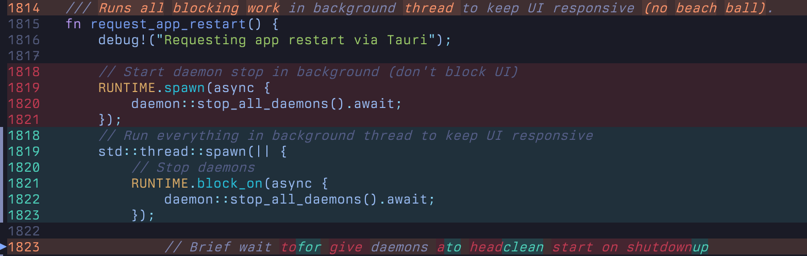

### Split View: Align Lines

#### align_lines = false

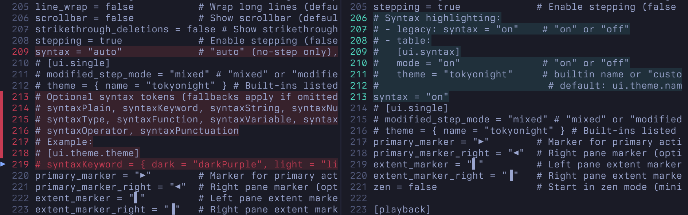

#### align_lines = true

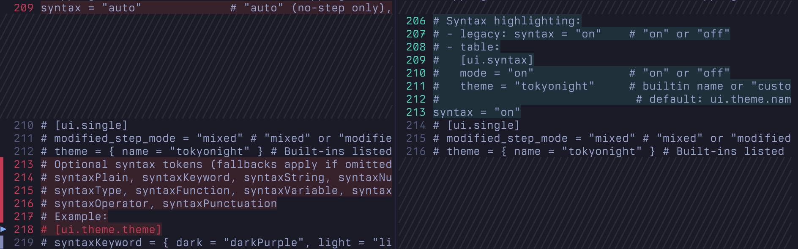

### Syntax Highlighting

#### syntax = "off"


